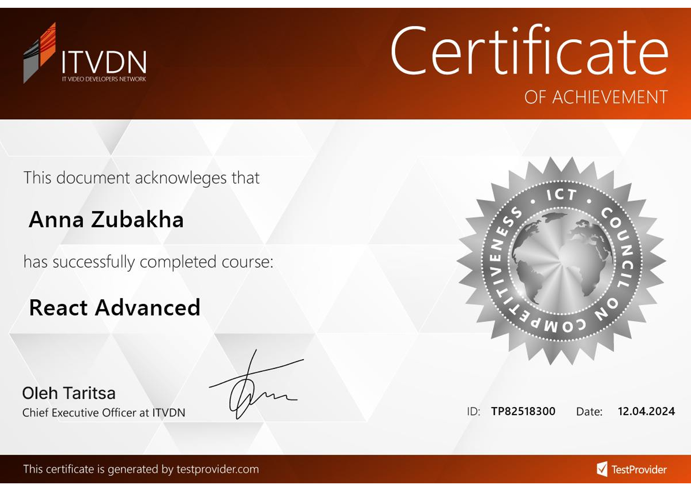

Hi, everyone

This code is my work on React Advanced Course. This project includes work with:

1. The Movie Database API.
2. Material UI.
3. Redux and Redux Toolkit.
4. Creating Custom Hooks.
5. Fake Authentication.
6. React.lazy and Suspense.
7. Using memo, useMemo, and useCallback.
8. Filtration.
9. TypeScript.

